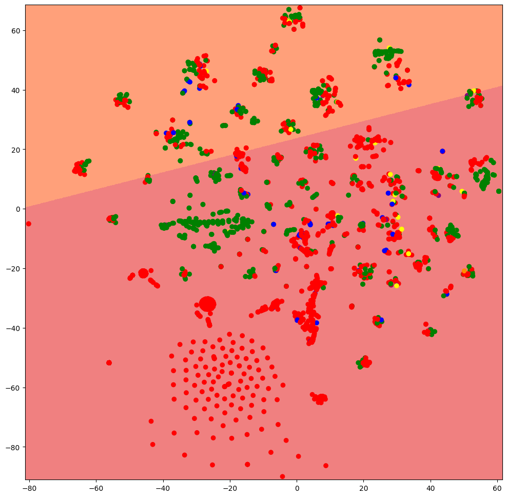

# ML-TV-IMDB

## Outline

Using Machine Learning to analyse data associated with the top television series on IMDB.

Evaluation 1 - Machine Learning - SA2023 - Guillaume Guex. 90%.

## Installations

- `pip install pandas`
- `pip install numpy`
- `pip install matplotlib`
- `pip install scikit-learn`

## Instructions

1. IMDB TV data is provided in `tmdb_tv_dataset.csv`.
2. Ensure you have completed the above installations.
3. Run each section of the Jupyter Notebook sequentially.
